# Research on Approaches from Data-Driven to Digital Transformation

**Authors:**  
Chen-Yao Chung¹, Chun-Hsien Yu², Jui-Yi Chung³, Wei-Hsien Wang⁴

¹Chinese Enterprise Resource Planning Society  
²National Defense University  
³National Central University  
⁴Soochow University  

## Abstract

With the emergence of generative AI, data science and technology have progressed very rapidly in recent years. The procedures for building models and predictions have become very mature. However, after the model is established, there is a big gap in how to integrate it with business strategies and decision-making. The predictive value of the model can only tell us the probability that the data belongs to which category value, but it cannot guide the selection of corporate strategies and decisions. Therefore, this study intends to propose a feasible method PAD (Prediction And Decision) as a model prediction and business decision-making connection foundation, making the operation process of this foundation smoother.

To implement the PAD method provided by this research, we used an OMO-like situation to measure and compare the implementation status of this PAD method. We collected the transaction data of six periods of activity, initially converting the activity data of the first five periods into Recency (R), Frequency (F), Monetary (M) as the basis of the independent variable (X), and whether there was a transaction in the sixth period as the target variable (Y), then establishing a supervised machine learning prediction model (Y=aX+b). Next, using the R, F, M data of the last five periods as prediction independent variables X, through the model Y=aX+b, we calculated the predicted value of the probability of repurchase for consumers in upcoming activities. If the predicted value is greater than 0.5, then we use OMO's backend management mechanism to send preferential messages to consumers who are more likely to participate in upcoming events (i.e., avoiding random targeting), ensuring the marketing efficiency of OMO model activities and enabling the entire digital transformation process to be automated in a data-driven manner.

**Keywords:** data-driven, digital transformation, data science

## 1. Introduction

### 1.1 Research Background

The era of big data has arrived. As described by The Economist magazine in 2016, "Data Data, Everywhere!" - data is everywhere, and companies are collecting more and more data. However, not all companies fully utilize this characteristic. Yet, organizations that can place data at the core of their strategy typically see performance improvements. How to effectively use digital technology to analyze big data, use analysis results to set strategies, make decisions, and further create more value for customers, enabling better operational performance for enterprises - the data-driven concept is crucial. Additionally, the concept of digital transformation, which fundamentally reshapes organizational operations, has gradually gained attention from enterprises in recent years. Its greatest feature is establishing competitive advantages through large-scale advanced digital technology to improve customer experience and reduce costs. Both data-driven and digital transformation concepts emphasize the complementary benefits that data, organization, and strategy can bring to companies, focusing on using data analysis and interpretation as the foundation for strategy and decision-making.

Today, "Digital Transformation" has become an all-encompassing term, like past commonly used terms such as "Cloud" and "Big Data," meaning different things to different people. Most enterprises view digital transformation as using advanced digital technology to analyze data, focusing on the development of these digital technologies, but potentially overlooking that these are just digital tools. The focus should be on business digitization and the transformation of the entire corporate system including organization, culture, talent, mindset, processes, and technical architecture. This issue is crucial for organizational competition and survival. If enterprises cannot clearly understand what digital transformation is and adjust their organization around specific digital transformation plans, they cannot successfully achieve transformation.

### 1.2 Research Motivation

In the field of data science, the advancement of model building and data prediction algorithms has been very rapid, and the procedures for building models are also very stable and mature. However, there is great uncertainty in how to integrate models with business strategies and decision-making after model establishment. Usually, predictive values from models can only tell us the probability that each piece of data belongs to which category, but cannot guide the selection of corporate strategies and decisions. There is a large gap in between. However, in the process of data science analysis, collecting and cleaning data, building models, making predictions, and analyzing results are not the ultimate goals of enterprise digital transformation. Instead, the goal should be to use these analysis results and models to assist companies in making better strategies, improving the overall operational execution efficiency of the company, such as using model predictions to design better marketing plans and allocate better enterprise resources. Therefore, this study proposes a feasible method called PAD (Prediction And Decision) as a connection foundation between model prediction and business decision-making, making this foundation operate more smoothly in the data-driven and digital transformation process.

### 1.3 Research Objectives

Based on the research background and motivation described above, this study will propose a method that can connect data science technology and decision-making according to the information characteristics of both data science procedures and strategic decision-making. This method enables data science modeling and prediction to smoothly combine with the costs required for subsequent strategic activities to generate better strategic direction plan designs.

In summary, the structure of this study is as follows: besides the introduction described above, it includes relevant literature review, proposed research framework method, actual demonstration of the method process and simulation, and finally conclusions and recommendations for the proposed method.

## 2. Literature Review

### 2.1 Data Science

According to Wikipedia's definition, data science (DS) is a discipline that learns knowledge through data, with the goal of analyzing data by extracting valuable parts from data. The scope and procedures generally include five items: collecting data, cleaning data, exploratory data analysis (EDA), model building, and model deployment. The process starts from collecting data and ends with deploying a model that can answer enterprise questions. In other words, data science can only help enterprises produce model predictive values, but there is no explanation of how to connect subsequent applications of these model predictive values. Since business scenarios are full of uncertainty, when facing uncertain events, if we can estimate what results will occur from what behaviors applied to what people, there is room for improvement, which is quite regrettable.

Although the process from collecting data, building models, making predictions, to making decisions is quite lengthy, there is no clear method for how to make final decisions from models. However, this is the ultimate goal of digital transformation. Therefore, this study attempts to propose a feasible method as a supplement to subsequent steps in data science.

### 2.2 Digital Transformation

In the field of data science, the advancement of model building and data prediction algorithms has been very rapid, and the procedures for building models are also very stable and mature. However, there is great uncertainty in how to integrate models with business strategies and decision-making after model establishment. Usually, predictive values from models can only tell us the probability that each piece of data belongs to which category, but cannot guide the selection of corporate strategies and decisions. There is a large gap in between. However, in the process of data science analysis, collecting and cleaning data, building models, making predictions, and analyzing results are not the ultimate goals of enterprise digital transformation. Instead, the goal should be to use these analysis results and models to assist companies in making better strategies, improving the overall operational execution efficiency of the company, such as using model predictions to design better marketing plans and allocate better enterprise resources. Therefore, this study proposes a feasible method called PAD (Prediction And Decision) as a connection foundation between model prediction and business decision-making, making this foundation operate more smoothly in the data-driven and digital transformation process.

### 2.3 Data-Driven

According to Wikipedia's definition, a data-driven model is a computational model that primarily relies on historical data collected during the lifecycle of a system or process to establish relationships between input, internal, and output variables. Data-driven models are common in many articles and publications, developed from early statistical models, overcoming limitations brought by strict assumptions about probability distributions. These models have been affirmed in various fields, especially in big data computing, artificial intelligence, and machine learning, providing valuable insights and predictions based on available data. Simply put, in the past, we heavily relied on collecting questionnaire data for business data analysis, but this had issues with data incompleteness and authenticity of data responses. However, when switching to using real operational data from companies for business data analysis, we don't worry about data missing and data authenticity, and it can even reflect actual problems encountered in company operations. Therefore, this study attempts to use real transaction data from enterprise operations to build predictive models and further predict customer value to the company as the foundation for subsequent plan design or resource allocation.

### 2.4 Online-Merge-Offline Integration

Online-Merge-Offline (OMO) integration, also called "online merge offline," refers to a business strategy or model that combines online (Online) and offline (Offline) channels to provide a more comprehensive, consistent, and seamless customer experience. According to social software company LINE's perspective, OMO breaks the boundaries between online and offline to become an important business model in retail, providing consumers with smoother, barrier-free consumption experiences in both Online and Offline environments. The difference between OMO and O2O (Online to Offline) is that the former is data-driven and customer-centered, comprehensively grasping consumer shopping and consumption behavior footprints in both online and physical environments, and recommending products to consumers from data analysis, making Online and Offline data fully transparent and integrated, and can also serve as the foundation for mutual guidance at appropriate times. Precise personalized sales services and smooth shopping experience environments create rapid revenue growth for enterprises.

Additionally, to enhance the commercial value of OMO integration, some enterprises have integrated platform concepts and location-based services (LBS) to strengthen OMO value. For example, LINE Beacon can actively push promotional messages to customers passing by stores, attracting customers to become members, making OMO virtual-real integration more efficient. The richness of data that OMO business scenarios can provide is more conducive to the practice of model prediction and decision methods. For this reason, this study will use OMO business scenario data to illustrate the implementation of the PAD method.

## 3. Research Framework Method

### 3.1 Combining Data Science Models with Decision-Making

As mentioned above, the lifecycle of data science can basically be divided into five steps: collecting data, cleaning data, exploratory data analysis (EDA), model building, and model deployment. The focus of the first three steps is on organizing data and finding insights in the data, only able to gain insights into overall operational trends and directions from company data, and outline the strengths and weaknesses of company operations, providing materials for strategy selection. The last two steps only involve building models through historical data and predicting business possibilities. For example, if you want to know whether customers will return to purchase again in the next period, you can build a supervised machine learning model to predict customer repurchase probability. At this point, the data science work procedure is completed, not only obtaining a model with good predictive ability but also obtaining a set of repurchase probability predictions. However, these cannot respond to the needs of digital transformation, which requires integrating advanced digital technology and solutions into all areas of the enterprise. If we can modify the overall process to use data to build models, then use models to make predictions, and finally use predictions to make decisions, when we have a comprehensive understanding of this overall process, we will find that for enterprise digital transformation, as described earlier, the most important core process in digital transformation is actually starting from making predictions, then proceeding all the way down to strategy and decision-making. In other words, if you don't do the core process from prediction to decision well, then the company's digital transformation will not be very successful, otherwise, the chance of success is higher.

For this reason, this study proposes a step that can combine data science models with decision-making, processing predictive values through reasonable assumptions in company operations. For example, to increase customer repurchase probability, some actions need to be taken: "sending discount coupons of a certain amount," "giving a certain amount for store visits," "collecting points for popular products," "giving products of interest to customer groups on weekends," etc. All such activity combinations must incur monetary costs, meaning these activities must have cost expenditures. Under the consideration of various activity cost expenditures and repurchase probability increases in any feasible combination, we find better combinations to provide important information for subsequent plan design. The concept is shown in Figure 1, using model predictions and some reasonable assumption data from enterprise management to conduct simulation work, finding solutions beneficial to the company under all possible combinations. That is, using three important tasks: assumption, simulation, and optimization to bridge the gap between prediction and decision. This method was conceived to connect the gap between prediction and decision, therefore this study calls this method PAD (Prediction and Decision, PAD).

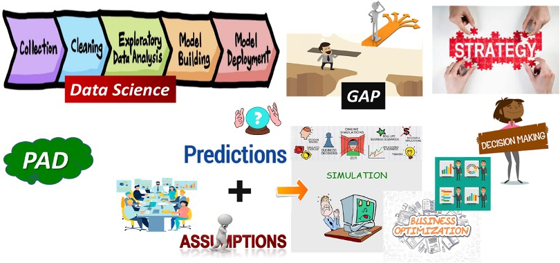
*Figure 1: The PAD methodology flow showing the connection between prediction and decision through assumption, simulation, and optimization processes*

### 3.2 PAD Method Steps

After the main function overview of the PAD method proposed by this study, we will introduce a customer transaction dataset PUR collected through the OMO backend as the foundation for PAD method implementation. The implementation details will be explained through seven work items: data organization, data exploration, model building, prediction, business assumptions, simulation optimization, and decision solutions, as shown in Figure 2.

*Figure 2: The seven-step PAD methodology workflow from data organization to decision solutions*

Among them, the data organization work item mainly includes data collection and cleaning mentioned in data science, while the data exploration work item mainly involves grouping customers according to their consumption attributes for observation, using R, F, M three important customer value attributes for grouping here.

For the model part, we use two methods: simple logistic regression and simple linear regression to build two models. Logistic regression is used to build a customer repurchase prediction model, and simple linear regression is used to build a customer repurchase amount prediction model. Next, using the above two models for prediction, we generate repurchase probability predictions (Rebuy) and repurchase amount predictions (Revenue) for each customer. Then, we substitute the Rebuy and Revenue predictions as parameters into Sunil Gupta's Customer Lifetime Value (CLV) formula and calculate the CLV prediction for each customer.

After the future value prediction for each customer is calculated, if the enterprise has no subsequent activities, then only model predictions cannot connect and satisfy the data required for decision-making. As described earlier, activities require cost expenditures, and this cost expenditure must be provided by departments that have previously undertaken related activities. If there is no historical cost expenditure data from previously undertaken related activities, then reasonable assumption range business cost data must be used here as the cost expenditure data for undertaking related activities. After combining predictions with assumption data, we can proceed to the next stage of simulation and optimization work.

The main focus of simulation and optimization work is to find solutions that are more beneficial to the company between different activity cost expenditure data and desired benefit data, finally selecting and providing feasible decision solutions for company use.

The entire PAD process starts from data collection and ends with the generation of feasible solutions. Through the introduction of real company transaction data, the information generation required for past marketing plan design is automated. Conceptually, using only the data-driven concept enables more efficient digital transformation work for companies.

## 4. PAD Method Implementation and Discussion

### 4.1 Data Organization

First, we obtained the customer original order transaction dataset PUR from the OMO platform, totaling over 54,000 records (customer transaction data from six activity periods). After screening, removing outlier data that would affect model prediction, PUR was reduced to 51,000 records, renamed as X_PUR. Next, we converted the transaction data in the X_PUR dataset into one record per customer, generating fields that can evaluate customer value: customer activity r (Recency), customer loyalty f (Frequency), customer contribution m (Monetary), and membership days s (Seniority). The s field represents customer depth, and we also kept the customer ID cid field. There were over 18,000 customer value records, renamed as customer value dataset A_CVM, using this A_CVM dataset as the foundation for the next stage of data exploration.

### 4.2 Data Exploration

This stage involves data exploration, with the main purpose of helping us understand our company's operational status as the foundation for subsequent strategic planning. At the same time, because when we know these things, you can target different groups with different marketing actions. Therefore, this study first uses K-means clustering to group customers. Here, we use the silhouette coefficient to find the optimal number of clusters, as shown in Figure 3, which displays the silhouette coefficient for various K-value scenarios. We use the K value with the highest silhouette coefficient for K-means clustering, suggesting 5 clusters here.

*Figure 3: Silhouette coefficient analysis showing optimal K=5 for customer clustering*

We set the customer group number to 5 for clustering and discussed the advantages and disadvantages of company operations. The clustering situation is shown in Figure 4: The X-axis represents store visit frequency f, and the Y-axis represents the average customer order value m for each group. Figure 4 shows that there are no customer groups in the upper right corner. We observed that there are three customer groups that are beneficial to the company: the 127-person group with high average customer order value, and the 2,937-person and 1,073-person groups with high store visit frequency. The remaining two groups (8,054-person and 6,226-person groups) are temporarily considered as poorer customer groups because they have low average customer order value and low store visit frequency, plus they haven't visited for a long time (i.e., large Recency values). Through this analysis, enterprises still have room for improvement and enhancement, and can design some marketing plans to move these customer groups to the upper right corner in the future, meaning high average customer order value and high store visit frequency. This is the important insight information we obtained through data exploration, using it as the company's strategic direction.

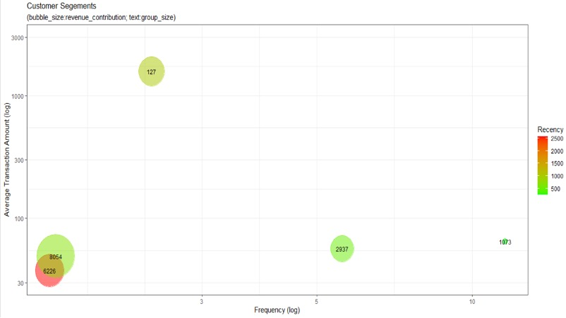
*Figure 4: Customer clustering results showing frequency vs. monetary value distribution with 5 customer groups*

In practice, for the convenience of easy identification when designing subsequent marketing plans, we will use another clustering method here. Using customer status that enterprise business teams understand for clustering will be more identifiable and can make the content of each group more stable, not changing the composition rules of each group every time. Through business personnel's daily assessment of their responsible customer interaction situations, we give group labels. Since labeling customer interaction situations is based on some rules discussed by frontline business personnel, this method is called rule-based clustering, which is a rule established internally by the enterprise. The advantage of such clustering is that the collected customer group content data is less affected by the randomness of machine learning methods, and it also allows marketing personnel to quickly grasp the characteristics of each group when designing plans and not be at a loss when formulating subsequent plans. So here we first divide customers into three types: new customers (N), regular customers (R), and sleeping customers (S), described as follows:

1. **New customers (N)**: According to whether the customer's s value is less than 2 times the average customer purchase cycle, and the customer's contribution to company revenue, further divided into N1: new customers, N2: new potential customers.

2. **Regular customers (R)**: According to whether the customer's s value is greater than 2 times the average customer purchase cycle and whether the most recent store visit purchase time is less than 2 times the average customer purchase cycle, and the customer's store visit frequency situation, further divided into R1: main customers, R2: core customers.

3. **Sleeping customers (S)**: According to whether the customer's s value is greater than 2 times the average customer purchase cycle and whether the most recent store visit purchase time is greater than 2 times the average customer purchase cycle, and the degree of disconnection situation of how long the customer hasn't visited for consumption, further divided into S1: drowsy customers, S2: half-sleeping customers, S3: deep-sleeping customers.

After the above actual rule-based clustering, the scale and distribution of each group are shown in Figures 5 and 6.

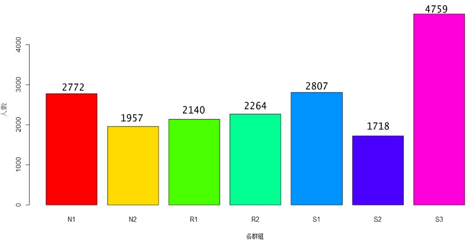
*Figure 5: Number of customers in each rule-based customer group (N1, N2, R1, R2, S1, S2, S3)*

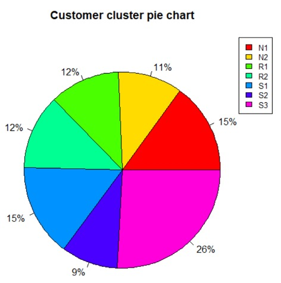
*Figure 6: Distribution analysis of customer groups showing their characteristics and proportions*

### 4.3 Model Building

First, we use two fields from the customer value dataset A_CVM as target variables for subsequent two models: Rebuy (whether they will repurchase) and Revenue (how much the repurchase amount will be). The two models are the customer repurchase prediction model and the customer repurchase amount prediction model. We use logistic regression to build the customer repurchase prediction model, and simple linear regression to build the customer repurchase amount prediction model.

Since Rebuy is binary data (repurchased, did not repurchase), after calculation, the model prediction accuracy reached 85.2%, and the area under the ROC curve is 0.88, indicating that this customer repurchase prediction model has very good predictive ability, as shown in Figure 7.

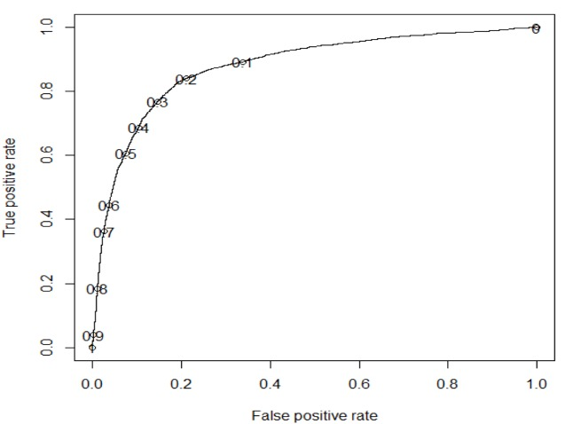
*Figure 7: ROC curve showing model performance with AUC of 0.88 for customer repurchase prediction*

Additionally, since Revenue is numerical purchase amount data, using simple linear regression method, common evaluation indicators include MSE, RMSE, MAE, and R-Squared (R²). After calculation, the model's R-Squared value is as high as 0.713, indicating that this customer repurchase amount prediction model has very good explanatory ability. The distribution of predicted vs. actual values is shown in Figure 8.

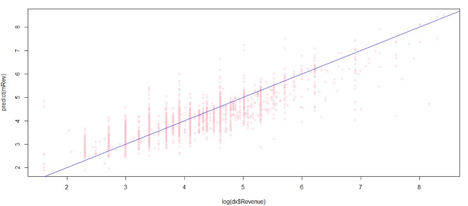
*Figure 8: Scatter plot showing predicted vs. actual revenue values with R² of 0.713*

### 4.4 Prediction

This stage mainly uses the predictions calculated from the two models built in the previous stage, substituting them into the Customer Lifetime Value (CLV) formula proposed by scholar Sunil Gupta, and calculating the N-period CLV prediction for each customer. Sunil Gupta's Customer Lifetime Value (CLV) formula is shown in Figure 9, where ri and mi are provided by the customer repurchase prediction model and customer repurchase amount prediction model from the previous stage, respectively. Then, combined with operating profit margin g (set here as g = 0.5, but can be flexibly modified according to actual conditions) and bank borrowing interest rate d (set here as d = 0.1, but can be flexibly modified according to actual conditions), we calculate the CLV prediction for each customer after N periods. Here, N takes 5 future periods for calculation, so N=5 is substituted into the formula.

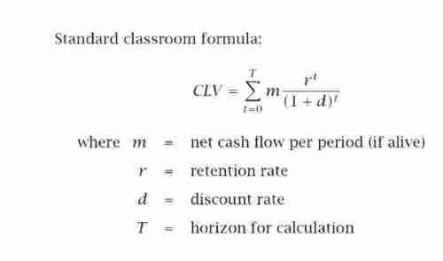
*Figure 9: Sunil Gupta's CLV formula showing the mathematical relationship between repurchase probability, revenue, and customer lifetime value*

Next, we examine the distribution of CLV data for all customers, as shown in Figure 10. When the X-axis is between 1.0~2.0, there are more customers. Since the X-axis between 1.0~2.0 here is log-transformed with base 10, the original data should be between 100-200 NTD, meaning most customers' CLV after N=5 periods is between 100-200 NTD.

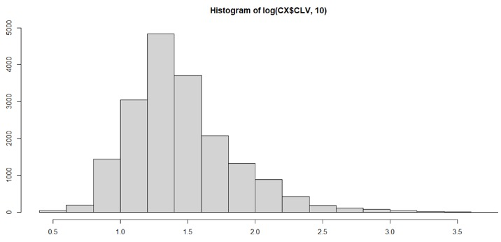
*Figure 10: Distribution of Customer Lifetime Value showing concentration between 100-200 NTD for most customers*

Before entering business assumptions, we must first understand the CLV differences among customer groups to seek appropriate methods subsequently. Therefore, we first compare the lifetime value of each customer group using the concept of averages, as shown in Figures 11 and 12. From Figure 12, we can observe the size and distribution of average lifetime value for each group. The R2 group has the highest average lifetime value and will remain an important customer group for the company in the future, requiring senior business personnel supervision and meticulous personalized services with excellent consumption experiences. The second highest is the N2 customer group, which has a high chance of becoming future R2 customer groups, so we should conduct aggressive interactive marketing for this group. The S1, S2, S3 groups have relatively low average lifetime values, but these three groups have quite a few customers with high CLV values, which are also worth the enterprise owner's attention. However, awakening these customers to repurchase requires much effort and cost expenditure to improve repurchase probability.

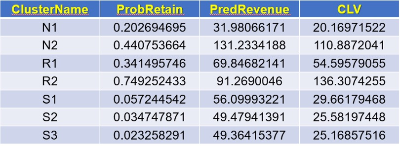
*Figure 11: Average Customer Lifetime Value comparison across different customer groups*

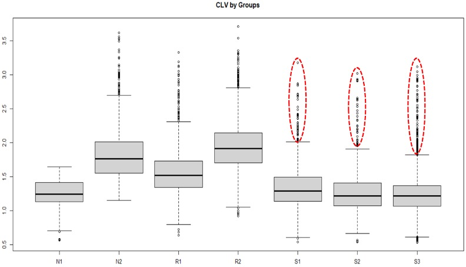
*Figure 12: Box plot showing CLV distribution and outliers for each customer group*

### 4.5 Business Assumptions

Only after selecting customer groups can we enter the true business assumption stage. Otherwise, any business assumptions without target objectives (i.e., customer groups) are unrealistic, as they become self-imagined scenarios, causing data that doesn't conform to reasonable enterprise operations to be set in subsequent model calculations, which cannot operate normally in practice. Since the research object this time is customer value data, the business assumptions in this study are actually finding marketing tools. For example, sending discount coupons of a certain amount is a marketing tool. Here, sending discount coupons of a certain amount is the marketing tool assumption in this study. Different discount amounts will cause different behavioral changes in customer group targets, such as increases or decreases in repurchase probability. Small amounts show no improvement effect, large amounts will have dramatic improvement effects, but when amounts continue to increase to very large levels, according to the law of diminishing marginal returns, limited improvement effects will occur. This phenomenon of input costs and response benefits is like a curved logistic function. Therefore, when selecting business marketing tools, it's like selecting a logistic function, as shown in Figure 13.

*Figure 13: Logistic function showing the relationship between marketing cost and repurchase probability improvement*

Continuing from our analysis and understanding of each customer group's CLV in the previous stage, we will select logistic functions suitable for each group's characteristics, testing different cost amounts and observing the repurchase probability improvement situation of customer groups. First, using the R2 customer group as the marketing target, with marketing tool cost (assumed 10 NTD), marketing tool expected benefit (assumed to increase next period's purchase probability to 0.75), we estimate the expected return for this group. The results show, as shown in Figure 14, that the group's average expected return is -10.262 NTD, with overall effect quite unsatisfactory. We suggest only targeting customers with positive returns for subsequent marketing plan targets. We can still select many marketing targets with large expected returns from R2, finding that among the R2 customer group, 258 people have expected returns greater than zero, using these as marketing plan targets. The expected return for these 258 people can reach 6,464 NTD.

*Figure 14: Expected return analysis for R2 customer group showing negative average returns but positive returns for 258 customers*

### 4.6 Simulation and Optimization

According to the explanation of selecting marketing tools and business assumptions in the previous stage, we will then conduct extensive calculations for each customer group, but only find customers with positive returns in each customer group for cost-benefit analysis of marketing tools. As shown in Figure 15, we can see that if we conduct marketing plans targeting the S1 customer group, we can also achieve good results, with total expected returns reaching approximately 80,914 NTD in profits.

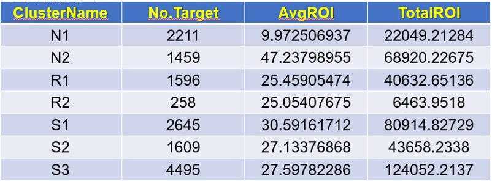
*Figure 15: Return on investment analysis showing S1 customer group achieving 80,914 NTD in expected profits*

### 4.7 Decision Solutions

Based on the above method introduction, we finally adopt different marketing approaches for each group. First, for S1, S2, S3 groups, we hold touching activities (such as "Stop Old Customer Diving" activities), using email marketing to send promotional activity-related messages with discount coupons.

For high CLV groups, R1, R2, N2 customer groups, we upgrade them to classic customer groups through levels, cultivate them into loyal customers, establish dedicated apps and constantly assign business personnel to monitor and greet them.

Finally, for the N1 customer group, we use social media marketing, adopting non-targeted marketing to let more people know about store activities, expand network influence, and attract N1 customer groups to consume.

## 5. Conclusions and Recommendations

### 5.1 Conclusions

Many companies hire data engineers, data analysts, and data scientists with engineering backgrounds when doing digital transformation. Indeed, these people will help you collect data, clean data, build models, and help companies create ML and AI models. However, these models are not the purpose of our digital transformation. The reason we do digital transformation is to use analysis results to make our brand strategies, marketing strategies, production management, supply chain management, etc. These business management strategies and decisions are the ultimate purpose of our digital transformation. The PAD method proposed in this study can serve as a way to connect data science procedures with strategic decision-making.

### 5.2 Recommendations

The PAD method lacks extensive data and various machine learning model simulations. We hope to continue proposing effective methods for these two points in the future as tools for digital transformation.

## References

SAP, "What is Digital Transformation?", https://www.sap.com/taiwan/insights/what-is-digital-transformation.html

Wikipedia, "Digital Transformation", https://zh.wikipedia.org/zh-tw/%E6%95%B0%E5%AD%97%E5%8C%96%E8%BD%AC%E5%9E%8B

Wikipedia, "Data-driven model", https://en.wikipedia.org/wiki/Data-driven_model

Learning Hub, "What is Data Driven? Learn how to use big data to help enterprises make major decisions!", https://www.hububble.co/blog/data-driven

Chanin Nantasenamat, "The Data Science Process", https://towardsdatascience.com/the-data-science-process-a19eb7ebc41b
